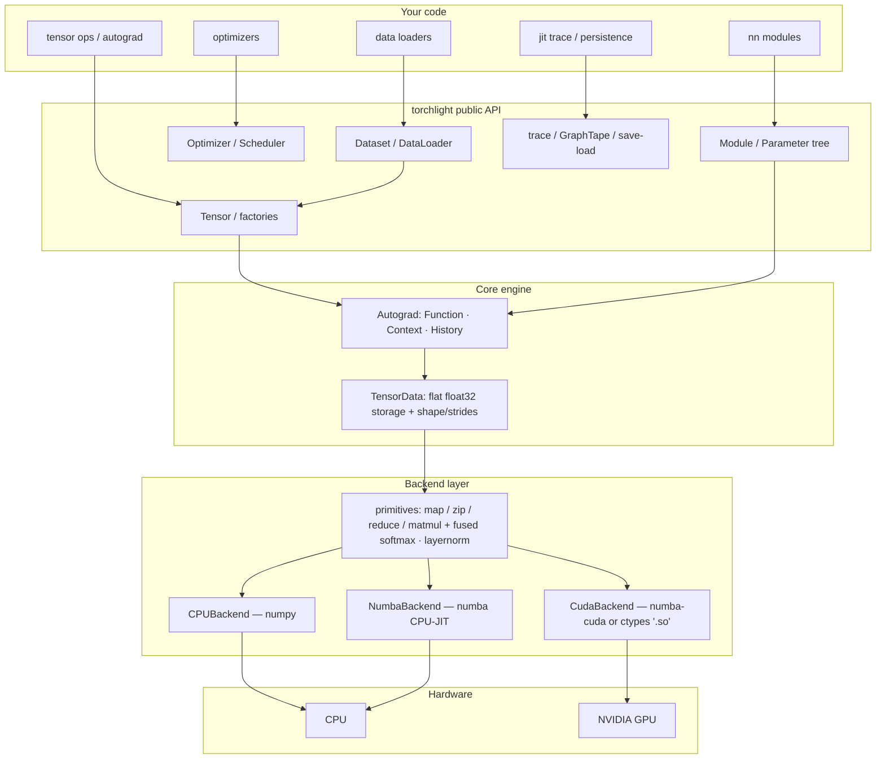
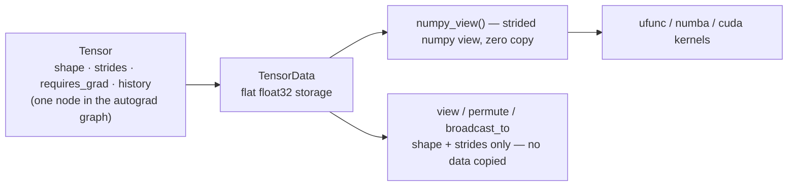
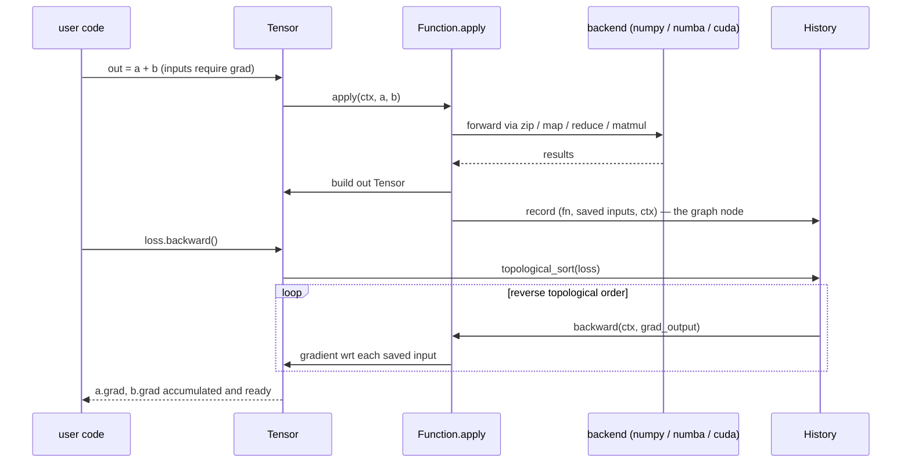
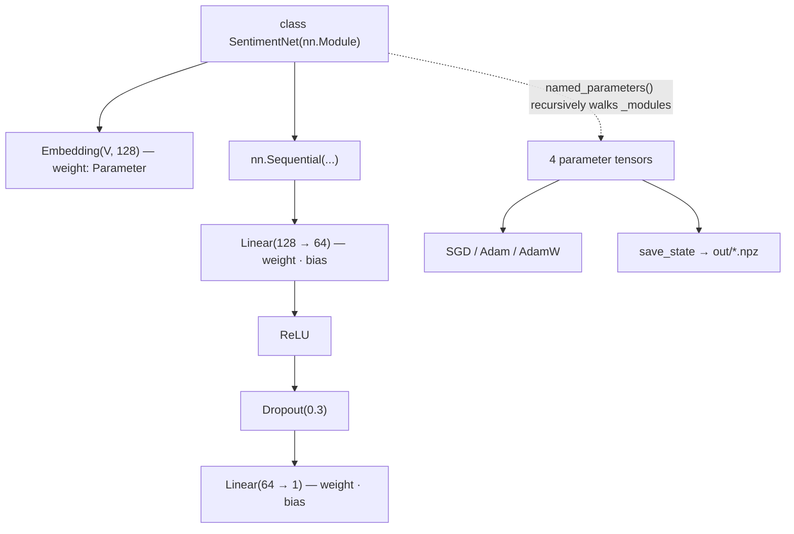
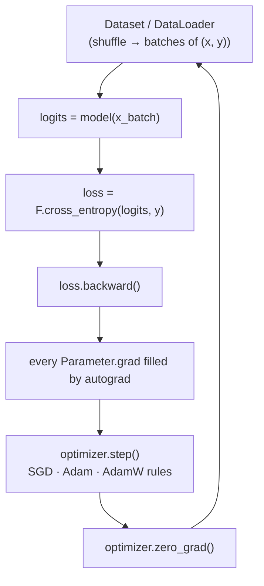
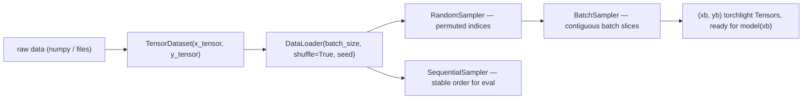
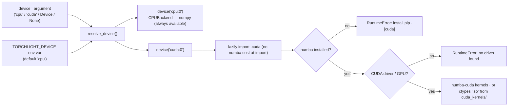
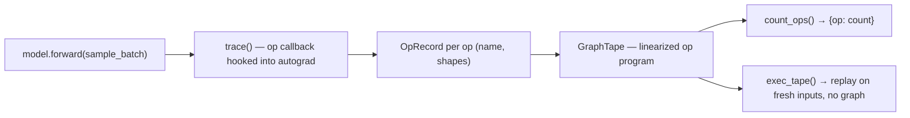

# Torchlight

**A lightweight, from-scratch deep learning framework** — with the same high-level
ergonomics as PyTorch (`tensor`, `nn`, `optim`, `data`), a tiny reverse-mode
autograd engine, and a numpy-backed CPU backend with optional numba and CUDA
accelerators. Built for learning and for small-scale experiments, and for
reading **every line** of what makes deep learning tick.

```python
import torchlight as tl
from torchlight.nn import Linear

x = tl.tensor([1.0, 2.0, 3.0], requires_grad=True)
y = (x ** 2).sum()
y.backward()
print(x.grad.to_numpy())          # [2.0, 4.0, 6.0]

model = Linear(2, 1)              # high-level API feels like torch
```

## System design at a glance

Everything above the kernel sits on a deliberately small stack. One diagram
for the whole system:



The bet of the design: **reduce everything to tensors, and compute everything
through a handful of primitives**. High-level layers (`nn`, `optim`, `data`,
`jit`) are pure bookkeeping on top; the math never leaves the primitive layer.

## 1. Tensors: numbers, shapes, and storage

A `Tensor` is a small object; the real data lives in a `TensorData` — a flat
one-dimensional `float32` numpy buffer described by shape/strides. Views,
broadcasts and transposes change *strides*, never the buffer:



- broadcasting = stride-0 dimensions; nothing is materialised,
- `view`/`reshape` reuse storage when contiguous, otherwise materialise,
- every factory accepts `requires_grad=True` and a `device=`.

## 2. The autograd engine

Reverse-mode automatic differentiation over a **dynamic** graph. Each forward
op is a `Function` that records a `History` node (its `Function` subclass, the
saved input tensors, and a `Context` for forward-side values) on its outputs;
calling `backward()` on the loss walks the graph in reverse topological order,
invoking each `Function.backward(ctx, grad_out)` to produce input gradients:



The whole engine is `src/torchlight/autograd/` (`autodiff.py` +
`functions.py` + `convolutions.py` + `indexing.py`) and is validated against
finite-difference gradchecks in the test suite. A scalar twin
(`tl.Scalar`, `tl.ScalarFunction`, `tl.derivative_check`) teaches the same
math on plain numbers.

## 3. Modules and parameters

`nn.Module` intercepts attribute assignment: a `Parameter` lands in
`_parameters`, a child `Module` in `_modules`, anything else in `__dict__`.
`parameters()`/`named_parameters()` then walk that tree recursively, so Adam
and the persistence layer can see every trainable tensor with zero extra
registrations:



Layers shipped: `Linear`, `Embedding`, `Conv1d/2d`, norm (`LayerNorm`,
`BatchNorm1d`), activations (`ReLU`, `Sigmoid`, `Tanh`, `GELU`, ...), pooling,
`Dropout`, plus losses and `F.masked_*`/`F.softmax_loss` helpers.

## 4. Optimizers and the training loop

Every optimizer gets one job — turn `param.grad` into a `param`
update — and one protocol: `parameters()`, `zero_grad()`, `step()`
(schedulers adjust the learning rate between epochs). The canonical loop:



| Optimizer                     | Update rule (per parameter)                                            |
| ----------------------------- | ---------------------------------------------------------------------- |
| `SGD (+momentum, nesterov)` | $p \leftarrow p - \eta \cdot m$                                      |
| `Adam`                      | $p \leftarrow p - \eta\,\dfrac{\hat{m}}{\sqrt{\hat{v}}+\varepsilon}$ |
| `AdamW`                     | Adam + decoupled weight decay$p\leftarrow p - \eta\lambda p$         |

LR schedulers (`StepLR`, `MultiStepLR`, `ExponentialLR`,
`CosineAnnealingLR`) shrink $\eta$ between epochs.

## 5. The data pipeline



Plus a synthetic-problem zoo (`make_synthetic`: `Simple`, `Diag`, `Split`,
`Xor`, `Circle`, `Spiral`) for smoke-testing a model before you feed it real
data.

## 6. Backends: the whole hardware layer is six primitives

All compute passes through **map / zip / reduce / matmul** (+ fused
softmax/LayerNorm kernels). That contract is small enough to reimplement in
numpy, numba and CUDA, so device parity comes from one interface. The device
argument is resolved through one funnel:



Guarantee: `import torchlight` is always fast and pure-numpy. Acceleration is
pulled in only when a kernel is actually requested.

## 7. JIT-ish tracing and persistence

`jit.trace` records a forward pass as an *op tape* (`GraphTape` of
`OpRecord`s) using the autograd hook — then you can count ops or replay the
program on new inputs without rebuilding any graph:



Persistence reuses the same parameter walk as training: `state_dict` →
`.npz` checkpoints (`save_state` / `load_state`) or whole-model pickling
(`save_model` / `load_model`). Every project in `projects/` saves
`out/<name>_model.npz` + `meta.json`, and each ships a `post.py` that reloads,
evaluates and plots.

## Features

- **Autograd engine** — reverse-mode auto-diff over a dynamic computation graph
  (`Function`, `Context`, `History`) with finite-difference gradchecks.
- **Tensor core** — N-dimensional, CPU-first tensors backed by numpy: strided
  views, broadcasting, and vectorised kernels (no element-level Python loops).
- **Neural network module** — `Module`/`Parameter` tree, `Linear`, `Sequential`,
  activations, dropout, normalization, pooling, and functional losses.
- **Optimizers** — `SGD` (momentum/nesterov), `Adam`, and `AdamW` + LR schedulers.
- **Data pipeline** — `Dataset` / `TensorDataset` / `DataLoader` with batching
  and shuffling, plus a synthetic-problem zoo (`Simple`, `Split`, `Xor`,
  `Circle`, `Spiral`, `Diag`).
- **JIT-ish tooling** — trace a forward pass as an op tape, count ops, and
  replay it without rebuilding the autograd graph.
- **Persistence** — state dicts (`.npz`) and whole-model pickling.
- **Swap-able backends** — the whole hardware layer is four primitives + fused
  ops: numpy CPU out of the box, numba-cuda for NVIDIA GPUs as an optional install.

## Install

```bash
pip install -e .                # CPU backend (numpy) — works anywhere
pip install -e ".[cuda]"        # NVIDIA GPU backend (numba-cuda) — add GPU support
pytest                          # run the test suite (requires test extra)
```

No `PYTHONPATH` tricks needed for the docs build or tests — `src/` layout is
handled via `[tool.pytest.ini_options].pythonpath`.

## Quick start

```python
import torchlight as tl
from torchlight.nn import Sequential, Linear, ReLU
from torchlight.nn.functional import cross_entropy
from torchlight.optim import SGD

# Tiny MLP on synthetic classification data
from torchlight.data import make_synthetic

train = make_synthetic("xor", n=200)
x, y = train.to_batch()

model = Sequential(Linear(2, 16), ReLU(), Linear(16, 2))
opt = SGD(model.parameters(), lr=0.5)

for _ in range(20):
    opt.zero_grad()
    out = model(x)
    loss = cross_entropy(out, y)
    loss.backward()
    opt.step()
    print(f"loss = {float(loss.to_numpy().ravel()[0]):.4f}")
```

## Documentation map

**Home · System design** (this page) explains the layers; the tutorials take
them one by one:

- **Tutorials** — [Tensors](./tutorials/01-tensors.md), [Autograd](./tutorials/02-autograd.md),
  [Neural networks](./tutorials/03-neural-networks.md), [Data &amp; optimizers](./tutorials/04-data-and-optimizers.md),
  [Backends](./tutorials/05-backends.md), [JIT &amp; persistence](./tutorials/06-jit-and-persistence.md),
  [Real-world datasets](./tutorials/07-real-world-datasets.md).
- **Projects** (end-to-end, first-principles maths): [Sentiment classifier](./projects/sentiment-classifier.md),
  [Machine translation](./projects/machine-translation.md), [Transformer from scratch](./projects/transformers-from-scratch.md).
- **Examples**: [MLP on Breast Cancer](./examples/sklearn-classifier.md), [CNN on digits](./examples/sklearn-digits-conv.md),
  [Autoencoder](./examples/sklearn-autoencoder.md), [CUDA kernels](./examples/cuda.md).
- **API reference** — [core](./api/core.md), [tensor](./api/tensor.md),
  [autograd](./api/autograd.md), [nn](./api/nn.md), [optim](./api/optim.md),
  [data](./api/data.md), [jit](./api/jit.md), [backends](./api/backends.md), [utils](./api/utils.md).

## Project layout

```
torchlight/
├── src/torchlight/       # installable package
│   ├── core/             # tensor_data (strides/broadcast), device, scalar ops
│   ├── backends/         # CPU / numba / cuda backends: map / zip / reduce / matmul
│   ├── autograd/         # reverse-mode autodiff: autodiff.py, functions.py
│   ├── tensor/           # Tensor object + factories (tensor, zeros, randn, ...)
│   ├── nn/               # Module, Parameter, Linear, Embedding, activations, losses, norm
│   ├── optim/            # SGD, Adam, AdamW + LR schedulers
│   ├── data/             # Dataset, DataLoader, synthetic problems
│   ├── utils/            # state_dict, save/load models
│   └── jit/              # trace -> GraphTape -> replay / op counts
├── tests/                # pytest suite (gradchecks, nn, optim, data, jit)
├── examples/             # intro.py, persistence.py, sklearn demos, CUDA self-tests
├── projects/             # end-to-end experiments on real data (see Projects above)
├── benchmarks/           # perf and comparison benchmarks
└── docs/                 # this documentation
```
